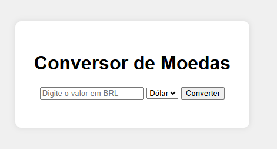

# 💱 Conversor de Moedas

Um projeto simples em HTML, CSS e JavaScript para converter valores de Real (BRL) para Dólar (USD) ou Euro (EUR), usando valores de câmbio fixos.

## 🚀 Funcionalidades

- Inserção de valor em BRL
- Conversão para USD ou EUR
- Interface simples e responsiva

## 📸 Screenshot



## 🛠️ Tecnologias usadas

- HTML5
- CSS3
- JavaScript puro

## 📁 Como usar

```bash
# Clone este repositório
git clone https://github.com/luciano-veiga/conversor_de_moedas.git

# Acesse a pasta
cd conversor-moedas

# Abra o arquivo index.html no navegador
