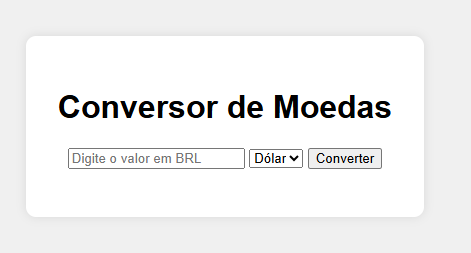

# 💱 Conversor de Moedas

Um projeto em HTML, CSS e JavaScript puro para converter valores de Real (BRL) para Dólar (USD), Euro (EUR), Libra (GBP) ou Peso Argentino (ARS), usando **cotação em tempo real** via [AwesomeAPI](https://docs.awesomeapi.com.br/api-de-moedas).

## 🚀 Funcionalidades

- Inserção de valor em BRL
- Conversão para USD, EUR, GBP ou ARS com cotação atualizada em tempo real
- Cache de 5 minutos por par de moedas para reduzir chamadas à API
- Tratamento de erros de rede e valores inválidos
- Interface simples e responsiva

## 📸 Screenshot



## 🛠️ Tecnologias usadas

- HTML5
- CSS3
- JavaScript puro (Fetch API)
- [AwesomeAPI](https://docs.awesomeapi.com.br/api-de-moedas) — API pública e gratuita de cotações de câmbio, sem necessidade de chave de acesso

## 📁 Como usar

```bash
# Clone este repositório
git clone https://github.com/luciano-veiga/conversor_de_moedas.git

# Acesse a pasta
cd conversor_de_moedas

# Abra o arquivo index.html no navegador
```

Não é necessário nenhum passo de build ou instalação de dependências — é HTML/CSS/JS puro, funciona direto no navegador.

## 🔍 Como funciona a conversão

O projeto consulta o endpoint `https://economia.awesomeapi.com.br/json/last/BRL-{MOEDA}` da AwesomeAPI, que retorna a cotação da moeda de destino em relação ao Real. O valor informado é então convertido com base nessa cotação atualizada.
